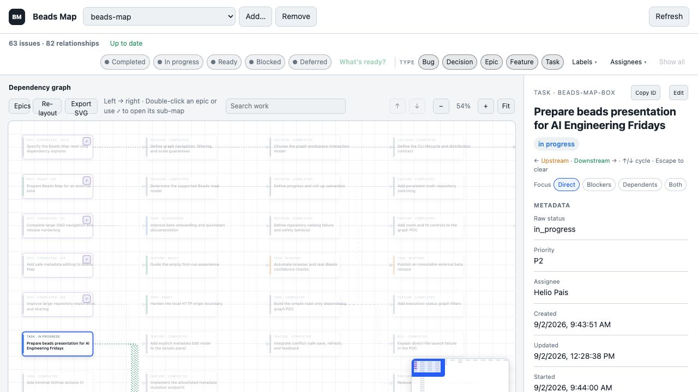

# Beads Map

Beads Map is a local visual workspace for a single [Beads](https://github.com/gastownhall/beads) repository at a time. It makes the task dependency DAG, epics, status, and the small set of approved metadata edits easier to explore without replacing Beads as the source of truth.

**Invited beta.** This is ready for macOS developers who already use Beads and are comfortable sharing focused feedback. It is macOS-first; Linux is a best-effort path, and Windows is not supported yet.



*Beads Map 0.2.10 running against its own Beads repository. The app is local: the graph and selected task details stay on your computer.*

## 1. One-minute quickstart

1. Install [uv](https://docs.astral.sh/uv/getting-started/installation/) and the [Beads CLI](https://beads.gascity.com/getting-started/installation). On macOS, Homebrew is the simplest route:

   ```bash
   brew install uv beads
   bd version
   ```

2. Install the reviewed wheel from the immutable `v0.2.10` invited-beta release:

   ```bash
   uv tool install "https://github.com/heliopais/beads-map/releases/download/v0.2.10/beads_map-0.2.10-py3-none-any.whl"
   beads-map --version
   ```

   A fixed-tag source install is available as a fallback: `uv tool install "git+https://github.com/heliopais/beads-map.git@v0.2.10"`.

3. Start from an existing Beads repository. The browser opens automatically.

   ```bash
   beads-map /path/to/your/repository
   ```

   The repository needs an initialized `.beads/` directory. If you are starting a new project, initialize it first:

   ```bash
   cd /path/to/your/repository
   bd init
   ```

## 2. Requirements and support boundary

- macOS is the supported beta platform. Linux may work when Python 3.11+, `uv`, and `bd` are available on `PATH`, but it has not received the same hands-on verification. Windows is unsupported for this beta.
- Python 3.11 or newer, `uv`, and `bd >=1.1,<2` are required. Beads Map checks the installed `bd` version before it starts.
- Each view represents exactly one repository; switching repositories switches to another independent DAG. Beads Map does not combine issue data or relationships across repositories.
- For beta feedback, open an issue in the [project tracker](https://github.com/heliopais/beads-map/issues) with `beads-map --version`, `bd version`, your operating system, and the smallest reproducible command or screenshot. Do not include private issue content unless you intend to share it.

## 3. Starting, switching, and stopping

Pass one or more repository paths on first launch:

```bash
beads-map /path/to/repository [/path/to/another/repository]
```

Those repositories and their view preferences are remembered. Later, `beads-map` reopens the catalog; use the header selector to switch. **Add** opens the native macOS folder chooser, so a full path is not required. Missing, moved, unreadable, and invalid entries remain visible with a warning: select one to **Retry** it, **Locate** its replacement, or **Remove** only that catalog entry. A failed recovery keeps the current graph visible.

The server listens only on your loopback interface. It prefers port 8765 and silently selects another free local port if that one is busy. Every app request requires the exact local `Host`; API requests reject a different `Origin`, and writes require a new random capability on every launch. See [security.md](docs/security.md) for the threat model and honest residual limits. Use `--no-browser` to avoid opening a browser or `--port 9000` to require one specific port:

```bash
beads-map --no-browser /path/to/repository
beads-map --port 9000 /path/to/repository
```

Press `Ctrl-C` in the terminal to stop it. Upgrades are deliberate: replace the version in the release URL only after reviewing a newer release. Reinstalling an earlier release wheel is also the rollback path; uninstalling removes the tool without touching any Beads repository or the local catalog.

```bash
uv tool install --force "https://github.com/heliopais/beads-map/releases/download/v0.2.10/beads_map-0.2.10-py3-none-any.whl"
uv tool uninstall beads-map
```

From a source checkout, this launcher also works without installation:

```bash
python3 beads_map.py /path/to/repository
```

## 4. Reading the map

The graph runs left to right. Solid edges are prerequisites, dashed edges are follow-on provenance, and dotted edges are parent-child hierarchy; only prerequisites affect a bead's Blocked state. Select a node to inspect it, highlight direct upstream and downstream relationships, and fade unrelated work without moving the map. The details panel can focus the complete prerequisite path, dependent outcomes, or both. With a selected node, Left/Right follows direct upstream/downstream relationships; Up/Down cycles multiple choices, and Escape clears the focus. The panel groups available metadata and dates, exposes clickable relationships, and safely shows exported descriptions, acceptance criteria, design, notes, and timestamped comments when present. Empty or unknown fields are omitted; **Copy ID** stays local to your browser.

Use the status chips, type chips, Label and Assignee menus, search, and **What’s ready?** to narrow the graph. Selections inside one menu are alternatives; different filter groups combine. **Show all** resets everything. If a filter hides an intermediate prerequisite, Beads Map keeps it as a compact dashed context card so the real path remains inspectable; context cards are not filter matches and return to normal with **Show all**. A no-match filter state explains how to restore the graph, while a genuinely empty repository uses different wording. Search matches ID, title, description, label, and assignee; Enter and Shift-Enter cycle matches.

Epics show direct-child progress. Double-click an epic, or use the `⤢` control on its card, to open a focused nested sub-map; **Back to full map** restores the overview and its previous filters. A sub-map begins with every status and type visible, and its filter choices do not overwrite the full-map view. **Epics** provides a repository-wide epic list. Drag empty canvas space to pan; `Cmd`-drag vertically to zoom around the pointer. The minimap appears when the graph extends beyond the viewport, and **Export SVG** downloads the current scope and filters as a self-contained SVG.

Beads Map supports up to 1,000 displayed issues and 3,000 displayed relationships. Above that, it pauses with exact counts and asks you to narrow the existing filters; **Render best effort** explicitly overrides that limit for the current snapshot. See [scale-verification.md](docs/scale-verification.md) for the repeatable fixture and measured baseline. Filter and metadata-only refreshes preserve the in-memory mental map. **Re-layout** discards the current scope's cached coordinates; manual coordinates are never persisted.

## 5. Editing and local-data safety

Normal graph reads use `bd --readonly -C <repository> export`. Beads Map does not write Dolt tables or `.beads/issues.jsonl` itself, does not sync Beads, and never creates, deletes, claims, closes, reopens, defers, or rewires issues.

The explicit **Edit** action on a selected bead can change only title, description, priority, assignee, and labels. Saving validates those fields, checks that the selected repository snapshot has not changed, invokes one allowlisted `bd update` command without a shell, then reloads from Beads. If validation, Beads, or a stale-snapshot check fails, the last good graph and your unsaved draft stay available for recovery. [metadata-editing-plan.md](docs/metadata-editing-plan.md) describes the boundary in detail.

The repository catalog stores paths and per-repository view preferences in your operating system's user configuration directory. It does not store issue data or edit drafts. Graph layout positions are cached only in memory. Beads Map checks for changes every five seconds; a failed read leaves the last good graph on screen and marks it stale.

## 6. Troubleshooting

### 6.1 `bd: command not found`

Install the Beads CLI using its [official installation guide](https://beads.gascity.com/getting-started/installation), then open a new terminal and run:

```bash
bd version
```

If that still fails, `bd` is not on your `PATH`; use the Beads guide's PATH instructions for the installer you chose.

### 6.2 Unsupported Beads version

Beads Map requires `bd >=1.1,<2`. Check the installed version with `bd version`, then update Beads using the same installation route (for example, `brew upgrade beads`). Restart Beads Map after upgrading.

### 6.3 “Not a readable Beads repository” or an unavailable catalog entry

Choose the repository root—not its `.beads` folder—and ensure it contains `.beads/`. Verify the read path directly:

```bash
bd --readonly -C /path/to/repository export >/dev/null
```

For a moved repository, select its warning-marked catalog entry and choose **Locate**. If you no longer want it in the selector, choose **Remove**; this only removes the remembered path, never the repository or its Beads data.

### 6.4 Port issue

Without `--port`, Beads Map automatically chooses a free local port. If you supplied `--port 9000`, either free that port or choose another one:

```bash
beads-map --port 9001 /path/to/repository
```

The terminal prints the exact local URL it opened. If the browser did not open, rerun without `--no-browser` or paste that URL into your browser.

## 7. Development and quality

The project is currently beta-quality software. GitHub Actions keeps the fast Python test, build, and isolated wheel/CLI smoke job on Linux and runs a focused macOS confidence job against a pinned supported Beads CLI: inline JavaScript syntax, one real browser journey, and one disposable real-Beads repository. Browser logs, page source, and a screenshot are retained when that job fails. Releases are published manually from a checked tag after both lanes pass; CI does not deploy the app.

The detailed product record lives in [specification.md](docs/specification.md). Beads is the project tracker; use `bd ready` in a source checkout to see available work.
